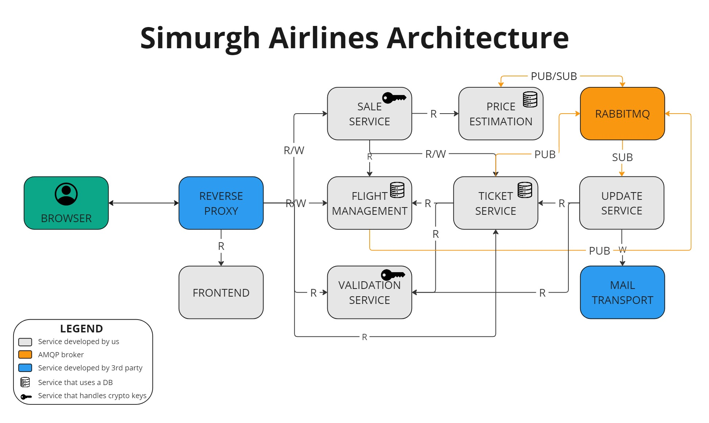

# Simurgh flight management system

## Description

This project wants to be an online IT system for an airline company operating in Europe, focusing on managing ticket sales and pricing. 

The system handles direct flights for a single airline, allowing administrators to define flights and schedules. It supports dynamic ticket pricing based on seasonality and economic factors, offering customers variable pricing options. Customers receive email notifications for ticket updates, ensuring they are informed about any changes. The system also includes a robust ticket validation mechanism for reliable verification before boarding, ensuring a seamless and efficient travel experience. This project aims to enhance the airline's operational efficiency and customer satisfaction through effective ticket management and adaptive pricing strategies.

## How to run

1. Install Docker from https://docs.docker.com/get-docker/
1. Run `docker compose up -d`
1. Enjoy at http://localhost:80
1. To interact with emails go to http://localhost:8025

## API Layer
The complete set of functionalities that the system provides is available at the `proto` repository <a href="https://github.com/ScalabilityIssues/proto">here</a>. It's a special repository, that contains the definition of the grpc services of all microservices. This is included as submodule in each repository and is necessary for the server to know what it should implement and for the client to know what are the remote procedures that it can call

## System architecture description

Based on the [architectural characteristics](architectural-characteristics.md) defined for our project, we opted for a microservice architecture with choreography approach (INSERT ADVANTAGES?).
Embracing this approach, these are the most important considerations we did:
1. We based on the requirements on the [architectural kata](architectural-kata.md) to identify what are the main duties of the whole system. As a general principle, each duty is assigned to a microservice. The services we identified are described in [Service descriptions](#service-descriptions).
1. Each microservice has its own database (if needed): we identified the most appropriate way to store the data, considering how the data is accessed and stored and the scalability of each approach
1. Microservices need to interact among them to perform actions that lead to the final objective of the application: to communicate one with the other we decided to use grpc because (INSERT REASON)
1. grpc is a good way to interact but not always the most appropriate. Sometimes there are events that trigger multiple actions that are possibly independent; the best approach is to use the AMQP protocol, where the event is published to the broker and all services that have some duties with respect to that kind of events can subscribe to a queue. Our choice fell into RabbitMQ, since it is easy to configure and use but at the same time is a powerful tool used in real world deployments
1. TEST for SOME MICROSERVICES
1. Once each service is developed the challenge consists in running them together to make interactions possible. To achieve this, we designed this strategy:
  - each microservice has its own github repository
  - each repository has a github action properly configured that at each push create a Docker image of the service
  - each repository has also a `compose.yml` that allow to run the containers needed to develop and test the code of that repository 
  - the `documentation` repo contains the `compose.yml` to run the whole application
1. We decided to use Rust to develop most of our application since it is a compiled, reliable, high performant language. Its compiler is really strict and even if the language it's not so beginner friendly, it saves a lot of time by making emerge possible errors in advance. The price estimation services, instead, is written in Python because is the standard the facto programming language for the Machine Learning and also allows convenience library for data scraping. The GUI in the frontend repository is developed with NextJS framework that provides fast and effective tools for building single page web application.
1. REVERSE PROXY

More considerations on the ~~perfect~~ least worst architecture for the application are available in section [Production consideration](#production-considerations)

## Service descriptions

### Sale service
The code is available <a href="https://github.com/ScalabilityIssues/sale-service">here</a>

The **Sale Service** microservice is responsible of providing the functionalities for purchasing tickets. More in details:
- It handle the ticket's discovery, allowing to list the available flights for a given route of a specific day. For each possible flight an offer is requested to the [Price Estimation](#price-estimation-service) service, that returns a price for that flight. 
- Offers are placed into a JWT that is signed. This allows to send offers to a client without the need to keep track of them; when the client decide to buy one of them, the offer can be trusted if the signature is valid
- The service also handles the purchase flow, where payments are simulated
- After the successful purchase of a ticket, it sends a request to [Ticket Service](#ticket-service) to create the ticket
 
### Price estimation service
The code is available <a href="https://github.com/ScalabilityIssues/price_estimator">here</a>

The **Price Estimation** microservice incorporates several key features to provide accurate and timely price predictions for airline tickets.

- Firstly, it employs a container named `ml-data-scraper` capable of periodic execution and configurable to extract flight and pricing information from various airline companies via <a href="https://www.kayak.com">Kayak</a> website.
Once the data retrieval process concludes, it uploads the gathered information to a distributed and efficient MinIO database stored within a designated bucket, while concurrently dispatching a notification through RabbitMQ signalling the completion of the task.
- Additionally, the microservice comprises a container labelled `ml-training` which remains on standby for incoming events indicating the arrival of new flight data. Upon receipt, it initiates the training of a new Machine Learning model tailored for price prediction. Once the training phase is complete, the newly created model is uploaded to a designated MinIO bucket.
- Finally, the microservice encompasses a container exposing a gRPC interface specifically designed for price prediction. This interface accepts input parameters such as airport information and dates and produces reliable price predictions. In the event of a newly trained model, it seamlessly incorporates the updated model for predictions; otherwise, it utilizes the latest available model stored within the MinIO repository, ensuring up-to-date and accurate price estimations for users.

### Ticket service
The code is available <a href="https://github.com/ScalabilityIssues/ticket-service">here</a>

The **Ticket service** microservice is responsible of ticket CRUD. More in details:

- It manages ticket creation, update and delete. The ticket deletion is implemented as a soft delete, in which the ticket is moved to a collection of deleted tickets
- Before a ticket creation it checks that a seat is available for that flight by making a request to the [Flight management service](#flight-management-service) to check how many seats the aeroplane has and compare that with the number of seats already booked
- After a ticket creation or update, it publishes on the broker to notify the client. The notification process is handled by the [Update service](#update-service)
- It uses a MongoDB database to store the tickets. We opted for that kind of database since tickets are the data that has the biggest impact on the system: the number of flights, airports and planes to manage is negligible compared to the number of tickets! MongoDB allows horizontal scaling, and since we don't need particular relations other then the flight the ticket refers to, we don't miss the relational schema

### Validation service
The code is available <a href="https://github.com/ScalabilityIssues/validation-service">here</a>

The **Validation Service** microservice is responsible of everything concerning the ticket authenticity. More in details:
- Since it deals with private keys, this service is isolated to ensure that the validation is completely detached from the ticket management
- It handle the cryptographic signing of tickets through a rpc method; in this way [Ticket service](#ticket-service) can make a request to sign a ticket  
- When a ticket is signed, a qr code is generated; it will contain the ticket and the signature; this is necessary to check the validity of the ticket
- The service also handles the public keys to verify tickets validity 

### Flight management service
The code is available <a href="https://github.com/ScalabilityIssues/flight-manager">here</a>

The **Flight management service** microservice is responsible of the CRUD operations of airports, planes and flights. More in details:

- Manage airports creation, update and delete. Delete is soft, is achieved by simply set the attribute `deleted = false`
- Manage planes creation, update and delete. Delete is soft, is achieved by simply set the attribute `deleted = false`
- Manage flights creation, update and delete. Updates and delete are handled with other tables, in particular
  - one for departure gate updates
  - one for the arrival gate updates
  - one for the cancellation updates
  - one for delay updates
- After a flight modification, the update function publish on the broker the modified flight; [Update service](#update-service) is then responsible of notifying clients that have a ticket on that flight
- It uses a PostgreSQL database to store the data about airports, planes and flights. Here the requirements for the choice of the database are different with respect to the [Ticket service](#ticket-service): indeed scalability is not an issue, while having a schema (and thus a relational DB) is quite useful due to the relation between the data stored

### Update service
The code is available <a href="https://github.com/ScalabilityIssues/update-service">here</a>

The update service microservice is responsible of sending email updates to involved users when it detects modifications on tickets or flights. More in details:

- It listens from the broker for changes on flights and send emails to users that have a ticket for that flight
- It listens from the broker for changes on tickets and send an email to the user owner of the ticket
- It communicates with a [MailHog](https://github.com/mailhog/MailHog) container that provides an SMTP server to send email
- The same MailHog container offers a nice feature where you can access to a simple email inbox to check all the received mail that are sent from the SMTP server. The app is available at http://localhost:8025

### Frontend
The code is available <a href="https://github.com/ScalabilityIssues/frontend">here</a>

The **Frontend** implements the monolithic GUI of the microservices-based system. The single-page web application provides the necessary functions for system administrators, the airline's staff, and customers. For convenience, the interface does not include user authentication and authorization; however, these features can be easily implemented in the future. Additionally, it is important to note that these security features are not considered requirements in the [architectural characteristics](architectural-characteristics.md) documentation.

Summarizing the graphical interface offers the following features:
- **Customer side**:
  - Flight search
  - Ticket purchase
  - Ticket visualization
  - Flight status updates

- **Staff side**:
  - Ticket validation for passenger check-in

- **Admin side**:
  - Add flights on the system
  - Add planes on the system
  - Edit the plane and the flight states
  - Check all the information present in the systems
  

## Production Considerations
In the project we focus particularly in designing and implementing an application that is compliant with the [architectural characteristics](architectural-characteristics.md). However some simplifications were adopted and here we want to explain what we would implement to make this production ready.

### API gateway
Currently, all incoming requests are dispatched by the [Traefik](https://doc.traefik.io/traefik/getting-started/install-traefik/) reverse proxy that acts as an ingress controller and dispatches requests to the appropriate microservices; in a real world deployment we would use an API gateway DESCRIBE BETTER

### Authentication
Currently there is no authentication at all; authentication is needed for admin and possibly also for staff, depending on specific security requirements of the company and airport.

### User interface to handle airports and aeroplanes
In the version delivered, the backend has the functionalities to handle airports; however it is not possible to handle them via the frontend due to the strong implications: think for example at the case where an airport is deleted but is used for flight, this will lead to inconsistencies that should be avoided. All this kind of corner cases should be discussed with the final company to create an ad hoc implementation.
(same for aeroplanes???)

### Caching offers
Since the application receives a lot of requests in term of available flights for a given route and date, it makes sense to cache offers for a certain time window in order to lower the amount of workload the price estimator has to do, with the aim of improve performance. 

### Invalidation of tickets
Another feature that is currently not available is the invalidation of tickets by staff members. This can come in handy when the airline company wants to withdraw the validity of a ticket, because there are no conditions to admit the passenger on the flight

### Keys rotations
To ensure bulletproof security of digital signatures, it is a common practice to perform key rotation. This is easy to achieve, but still not implemented in our application. However notice that our grpc method that returns the validation key supports it by returning a list of keys and not just a single key.

### Law compliance
Before delivering the product to the company, we would assess the compliance of our product to all applicable law (such as GDPR) with the help of an expert.